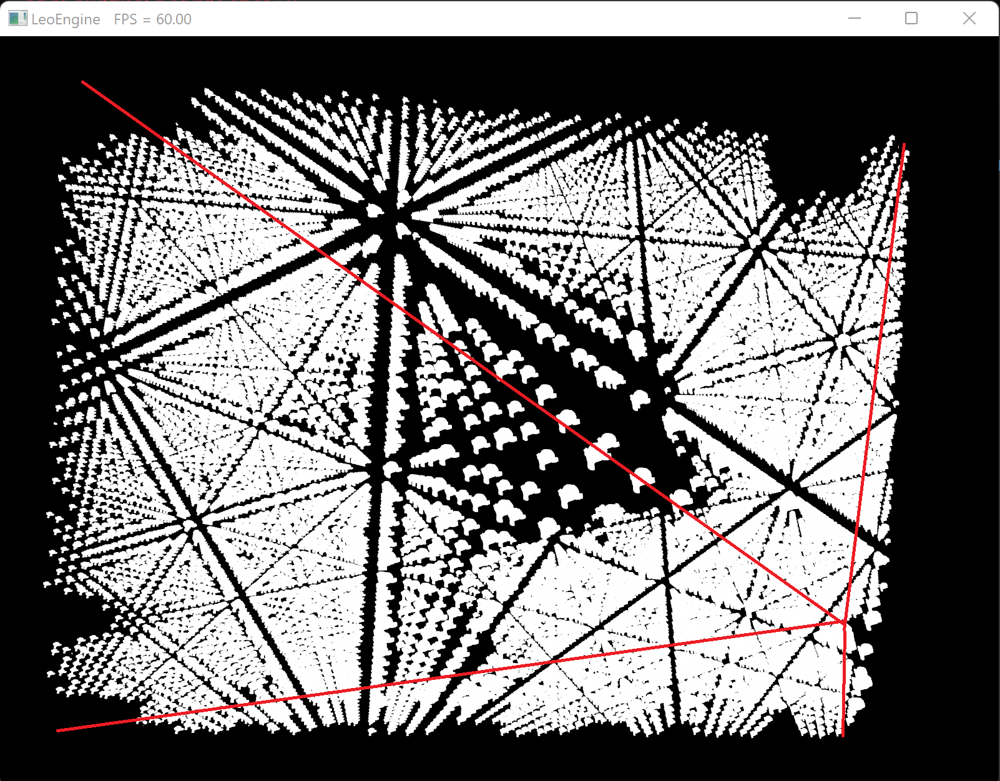
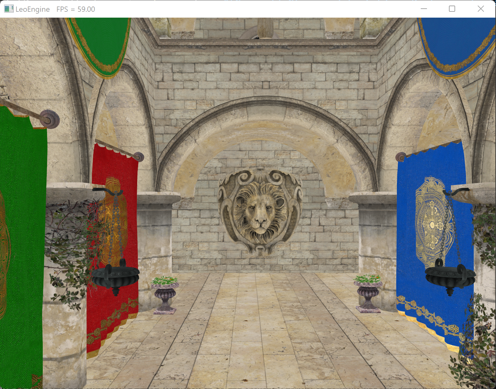
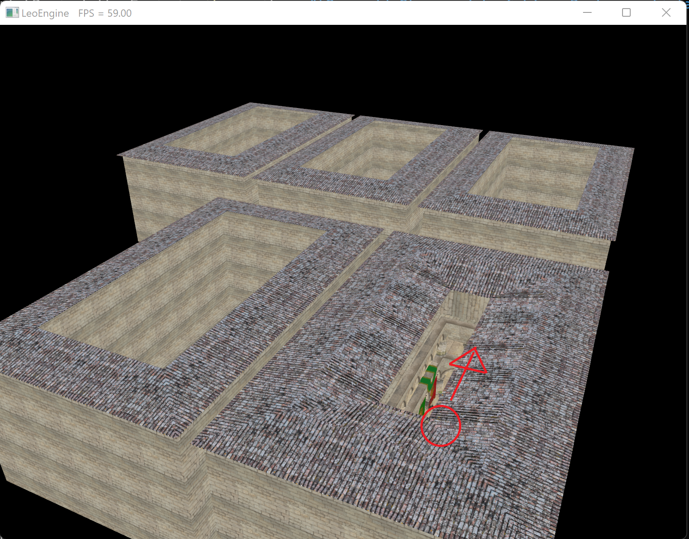
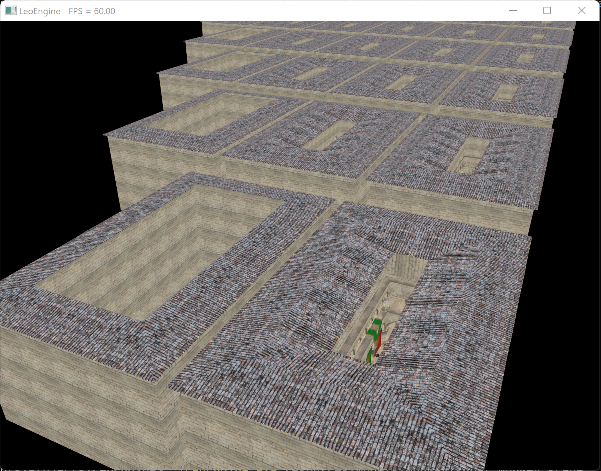
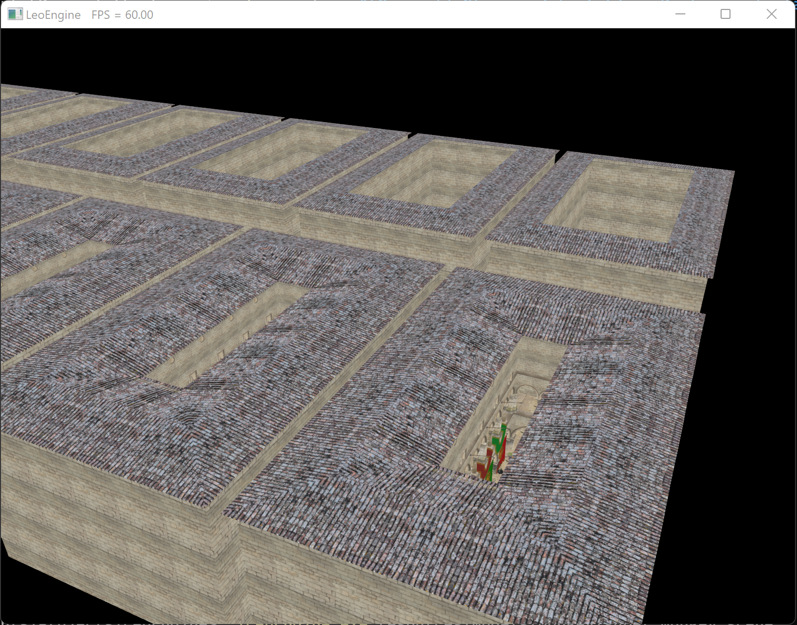

LeoEngine
=========

Description
-----------

A personal C++ Vulkan project I have been working on for a few months. It features indirect draw with both occlusion and frustum culling done on GPU in a compute shader, and should be extended with other features after I get some time off :)

<video width="640" height="480" controls>
  <source src="https://youtu.be/I7Pb8edW5U8" type="video/mp4">
</video>

### TODO ###

This is a work in progress. I am still investigating a few bugs:
* Some objects close to the camera or to the edges of a blocking object aren't culled.
* In the *sponza* scene, some big meshes (like the roof) are visibly culled by the bottom plane of the frustum if looking directly down from far above the building and moving forward.

I feel this is mostly related to the math in the indirect_cull shader. I had to modify it significantly from the vkguide reference (see *'Acknowledgments"*).

### Screenshots ###

| .") |
| :-----------------------------------------------------------------------------------------------------------: |
|                         Camera point of view (this is a giant field of monkey heads).                         |

|                                                                                                               |
| :--------------------------------------------------------------------------------------------------------------------------------------------------------------------------------------------------------------------------------------------------: |
| From another point of view, we can see what is culled from the camera's perspective. I indicated the frustum with red lines. The holes in the scene are due to occlusion culling. I was right behind a monkey head so the one in the center is huge. |

|                                              |
| :-----------------------------------------------------------------------------------------------------------------: |
| Camera point of view. This scene loads lots of sponza models (a classic test model displaying some kind of atrium). |

| ") |
| :-------------------------------------------------------------------------------------------------------------------------------------------: |
|                                            Behind the camera, meshes were culled (frustum culling)                                            |

|                                                                                                                                                              |
| :------------------------------------------------------------------------------------------------------------------------------------------------------------------------------------------------------------------------------------------------------: |
| From the top, we can see what is culled. I indicated the camera's point of view from earlier. In the sponza models around the camera, only the outer walls are loaded. I believe they could be culled and this is what I am investigating at the moment. |

|                                            |
| :----------------------------------------------------------------------------------------------------------------------: |
| Frustum culling only. The sponzas aligned with the frustum contain all their meshes since occlusion culling is disabled. |

|                |
| :------------------------------------------------------------------------------------------------: |
| Occlusion culling only. The sponza models on the left were culled by the frustum so they reappear. |

Building
--------

### Dependencies ###

**Short version: Install Vulkan 1.2. All other dependencies are located in the external folder.**

You need to have Vulkan SDK (version 1.2 or later) installed.
CMake will try to find it on your computer. You can also specify a path to the Vulkan lib and header files in the *.env.cmake* file located in the project's root.

I use several libs for resources loading, memory allocation and other stuff. They are included in the project (in the *external* folder). You can also specify paths to your own installation for some of them in *.env.cmake* if you want to.

The following (lib and headers) are included in the external folder:
* [GLFW](https://github.com/glfw/glfw)
* [Assimp](https://github.com/assimp/assimp)
* [VMA](https://github.com/GPUOpen-LibrariesAndSDKs/VulkanMemoryAllocator)

The following (headers only) are also included in the external folder:
* [STB image](https://github.com/nothings/stb/blob/master/stb_image.h)
* [GLM](https://github.com/g-truc/glm)

### Building the project ###

To configure the project, run

> cd LeoEngine && cmake .

CMake might ask you to specify a generator, in the case please use "Visual Studio 16 2019".

You can also use CMake-GUI of course.

Then open the .sln file with *Visual Studio (2019 or later)* and build the project. This should create the *LeoEngine.exe* file in the project source directory.

How to use
----------

**Launch *LeoEngine.exe* from the project root**. You don't have to specify anything more; it will open with a big scene loading hundreds of sponzas by default. You also can specify an .scene file path to load a specific scene. There are scene examples in *resources/Models*. Please use *relative paths* (starting from the project root, for example *"resources/Models/my_file.scene"*) and launch LeoEngine.exe from the root as well (where it should be located).

If you modify any shader, run the batch file located in *"Resources/Shaders"* to recompile all shaders.

Once the renderer started, you can use the following controls:
* **WASD** for moving around, **spacebar** to go up, **left shift** to go down (like in Minecraft, yes)
* **F** disables frustum culling, you can enable it again by pressing F again
* **O** disables occlusion culling, you can enable it again by pressing O again
* **L** locks the point of view from which culling is computed to the current camera's position. You can then move around and see what has been culled from the point of view you just set. Press L again to re-tie the culling point of view to the camera.
* **T** makes all objects transparent to see occlusion culling in action without having to lock the camera. You can now happily see how it does not work perfectly! Right now this doubles the number of draw calls so the application will move much slower. I mainly use this for debugging.

Acknowledgments and nice resources
----------------------------------
I first went through [vulkan-tutorial](https://vulkan-tutorial.com/) for some vulkan basics, then completed the knowledge I gained with [this very useful book](https://www.vulkanprogrammingguide.com/) on Vulkan, then [vkguide](https://vkguide.dev/) which gives nice advice on architecture and best practices. [This non vulkan-specific book](http://foundationsofgameenginedev.com/#fged2) also covers culling and is a very interesting read (and beautifully published on top of that).

Although the code is now very different from these guides, MaterialBuilder (and associated classes) and VulkanInstance are still close to what you can find respectively in vkguide and vulkan-tutorial, so props to them!

[Sascha Willem's](https://github.com/SaschaWillems/Vulkan) and [Khronos Groups's](https://github.com/KhronosGroup/Vulkan-Samples) Vulkan samples were also very useful to me.
Also [this very nice video series](https://www.youtube.com/playlist?list=PL0JVLUVCkk-l7CWCn3-cdftR0oajugYvd) about making a vulkan engine from scratch features live coding and is quite nice to watch.
